# PHASE 3: Continuous Machine Learning (CML) & Deployment

## Overview
Phase 3 implements continuous integration/continuous deployment (CI/CD) pipelines and productionizes TeamArtemisSE489 on cloud infrastructure. This phase covers automated testing, containerized workflows, CML integration, and multi-platform deployment options including GCP, Cloud Run, and serverless functions.

---

## 1. Continuous Integration & Testing

- [x] **Unit Tests**: Write pytest test scripts for data processing and model components
tests are available in the tests directory, the [test model](tests/test_model.py) file.
- [x] **Integration Tests**: Create integration tests for full training pipeline
- [x] **Test Coverage**: Aim for >80% code coverage with pytest-cov
- [x] **GitHub Actions - Tests**: Create workflow for running tests on every push
  available in the 
  - [x] Trigger on: push to main/develop branches and PRs
  - [x] Test across multiple Python versions if applicable
  - [x] Report coverage metrics
- [x] **GitHub Actions - Code Quality**: Create workflow for:
  - [x] Running ruff linter
  - [x] Type checking with mypy
  - [x] Formatting checks
- [x] **GitHub Actions - Docker Build**: Create workflow for building Docker image
  - [x] Build on PR and main branch push
  - [x] Test built image
- [x] **Pre-commit Hooks**: Set up pre-commit hooks for:
  - [x] Formatting (black/ruff)
  - [x] Linting
  - [x] Type checking
  - [x] Trailing whitespace
- [x] **Test Documentation**: Document how to run tests locally and in CI

---

## 2. Continuous Docker Building & CML

- [x] **Automated Docker Builds**: `.github/workflows/docker-publish.yml`
  builds the existing `dockerfiles/Dockerfile` on pull requests, pushes to
  Docker Hub on commits to `main`, and also supports manual runs through
  `workflow_dispatch`. The workflow uses Docker Buildx plus the official Docker
  login, metadata, and build-push actions so every published image receives a
  commit SHA tag and the default branch receives `latest`.
  - Required GitHub Actions secrets: `DOCKER_HUB_USERNAME`,
    `DOCKER_HUB_TOKEN`, and `DOCKER_HUB_REPOSITORY`.
  - Evidence still needed after pushing: screenshot of the green workflow run
    and screenshot of the pushed image in Docker Hub.
- [x] **Docker Push**: The build-push step publishes only on `push` to `main`
  or manual workflow dispatch, while PRs build the image without publishing.
  This prevents feature branches from overwriting registry tags while still
  proving that the Dockerfile compiles before merge.
- [x] **CML Workflow**: `.github/workflows/cml.yml` runs on pushes, pull
  requests, and manual dispatch. It installs Python 3.11 with `uv`, sets up CML
  with `iterative/setup-cml@v2`, runs `scripts/run_cml_report.py`, and posts the
  generated Markdown report back to the PR with
  `cml comment create --publish report.md`.
- [x] **CML Metrics Output**: `scripts/run_cml_report.py` creates a
  deterministic CI-safe ratings dataset, calls the repository's SVD training
  function, and writes `reports/cml/metrics.md` plus
  `reports/cml/metrics.json`. The reported metrics are RMSE, MAE,
  precision@k, recall@k, and training time.
- [x] **CML Plots**: The same CML script writes `reports/cml/metrics.png`, a
  compact bar chart that CML publishes and embeds in the PR comment.
  - Evidence still needed after opening a PR: screenshot of the
    `github-actions[bot]` CML comment showing the metrics table and plot.

---

## 3. Deployment on GCP

- [x] **GCP Project Setup**: GCP project `mlops-recommenderproject` (ID: `682507623900`) was created with `us-central1` as the default region.  The following APIs were enabled:
  ```bash
  gcloud services enable \
      artifactregistry.googleapis.com \
      cloudbuild.googleapis.com \
      aiplatform.googleapis.com \
      run.googleapis.com \
      compute.googleapis.com
  ```
- [x] **Service Account**: Cloud Build uses the default Cloud Build service account (`682507623900@cloudbuild.gserviceaccount.com`) which has Artifact Registry Writer permissions. Vertex AI custom jobs run under the default Agent Platform service agent, which has access to the GCS bucket via `--scopes=cloud-platform`.
  - [x] Artifact Registry — Cloud Build service account (`682507623900@cloudbuild.gserviceaccount.com`) granted `roles/artifactregistry.writer` automatically at project setup.
  - [x] Vertex AI — Agent Platform service agent has access to GCS bucket
  - [x] **Cloud Run** — Default Compute service account (`682507623900-compute@developer.gserviceaccount.com`) used by the Cloud Run to download model and data from GCS at startup.
  - [ ] Cloud Functions — not used
  - [x] Compute Engine — `--scopes=cloud-platform` used when VM was created
- [x] **Artifact Registry**:  Docker repository `mlops489-docker` stores both the training image and th serving image. Cloud Build pushes new versions automatically on every push to `main` via the `mlops-trigger` trigger. The full build spec lives in [cloudbuild.yaml](cloudbuild.yaml) at the repo root.
  - [x] **Create repository in Artifact Registry**: `mlops489-docker` repository created at `us-central1-docker.pkg.dev/mlops-recommenderproject/mlops489-docker`
  - [x] **Configure authentication from CI/CD**: Cloud Build authenticates to Artifact Registry automatically via the attached service account; local Docker auth configured with `gcloud auth configure-docker us-central1-docker.pkg.dev`
  - [x] **Push Docker images to registry**: Image
    `teamartemisse489-train:v1` (3.1 GB) successfully pushed. Latest image digest:
    `sha256:f8243a54...`. See Cloud Build history screenshot below.
  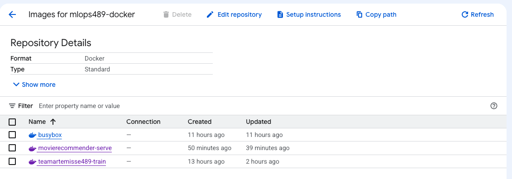
  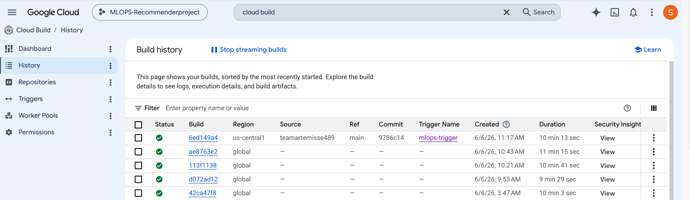
- [x] **Vertex AI Training (Option A)**: The SVD model was trained as a Vertex AI custom job. Vertex AI automates the full VM lifecycle — it provisions the worker, runs the container, captures logs, and shuts down automatically. The container reads training data directly from GCS via the automatic `/gcs` mount and writes the trained model back to GCS — no data is baked into
  the image.
  - [x] **Create training container image**: [dockerfiles/Dockerfile] (dockerfiles/Dockerfile) builds a `python:3.11-slim-bookworm` image with all dependencies from `requirements.txt`, source code from `src/`, and Hydra configs from `configs/`.
  - [x] **Configure training job specification**: [config_cpu.yaml] (config_cpu.yaml) specifies `n1-standard-4` (4 vCPUs / 15 GB RAM), 1 replica, and passes GCS paths as Hydra overrides via `containerSpec.args`:
  - [x] **Document how to submit training jobs**:
    ```bash
    # Submit
    gcloud ai custom-jobs create \
        --region=us-central1 \
        --display-name=mlops489-train \
        --config=config_cpu.yaml
 
    # Stream logs
    gcloud ai custom-jobs stream-logs <job-id> --region=us-central1
 
    # Clean up — finished jobs are free, only running jobs bill
    gcloud ai custom-jobs list --region=us-central1 \
        --filter="state:JOB_STATE_RUNNING OR state:JOB_STATE_PENDING"
    ```
 
    Job `1276662175284330496` (`mlops489-train-v4`) completed successfully
  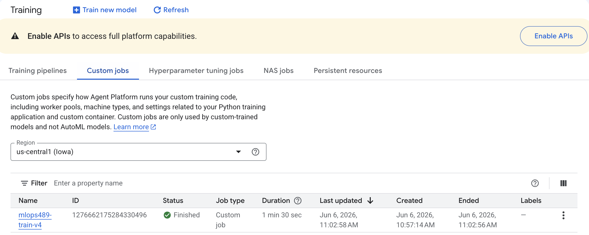
- [ ] **Compute Engine Training (Option B)**: Not used
- [x] **Model Registry**: Trained model artifacts are stored in the GCS bucket `gs://mlops489-dvc-123456/models/`. The bucket already existed as the DVC remote store; a separate `models/` prefix is used for trained artifacts so DVC-managed data and model outputs stay cleanly separated.
  - [x] **Create GCS bucket for models**: `gs://mlops489-dvc-123456/models/` prefix used within the existing DVC bucket

  - [x] **Implement model upload from training**: The training script saves the fitted SVD model via `joblib.dump` to the path specified by `cfg.paths.model_dir`.  When run on Vertex AI with `paths.model_dir=/gcs/mlops489-dvc-123456/models`, the file is written directly to GCS:
    ```bash
    gsutil ls gs://mlops489-dvc-123456/models/
    # gs://mlops489-dvc-123456/models/svd.joblib
    ```
    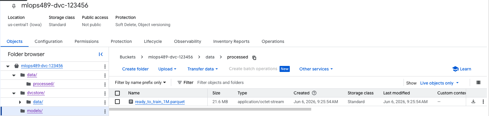
    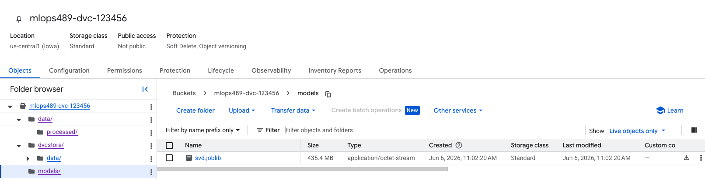

  - [x] **Document model retrieval**:
    ```bash
    # Download model locally
    gsutil cp gs://mlops489-dvc-123456/models/svd.joblib models/svd.joblib
    # Or load directly in Python
    import joblib
    model = joblib.load("svd.joblib")
    ```

- [x] **FastAPI Service**: A FastAPI application [app/main.py](app/main.py) wraps the trained SVD model and exposes three endpoints. At startup, the app downloads  the model and data files from GCS using `google-cloud-storage` — nothing is baked into the image. This keeps the serving image small (~800 MB vs ~4 GB if data were included) and makes it trivial to update the model without rebuilding the image.

  - [x] Define inference endpoint(s)
    | Method | Path | Description |
    |---|---|---|
    | `GET` | `/` | Root — confirms API is live |
    | `GET` | `/health` | Health check — used by Cloud Run readiness probe |
    | `POST` | `/predict` | Returns top-N recommendations for a user |

 - [x] **Implement request validation**: Pydantic models enforce the schema:
    ```python
    class PredictRequest(BaseModel):
        user_id: int   # must be a valid integer userId
        top_n: int     # must be between 1 and 100 (default 10)
    ```
  - [x] **Add health check endpoint**:
    ```bash
    curl https://movierecommender-serve-682507623900.us-central1.run.app/health
    # {"status":"ok","model_loaded":true,"catalogue_size":8191,"users_in_index":565657}
    ```
 
  - [x] **Document API specification**: Auto-generated OpenAPI docs available at:
    ```
    https://movierecommender-serve-682507623900.us-central1.run.app/docs
    ```
 
    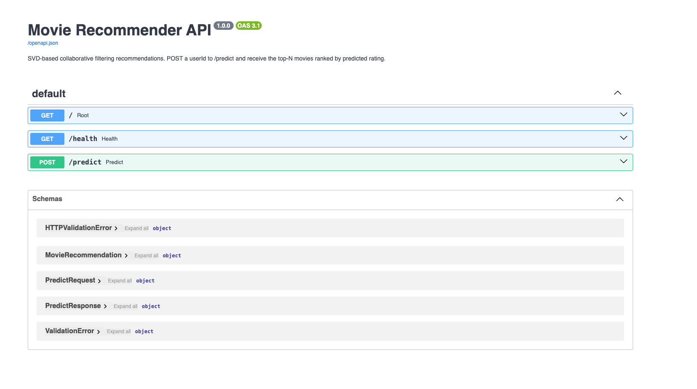
    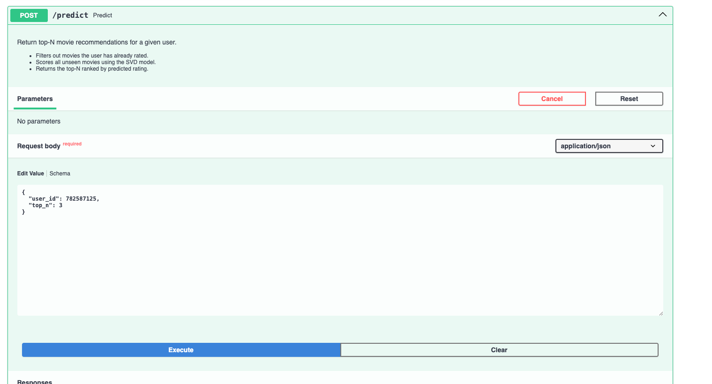
    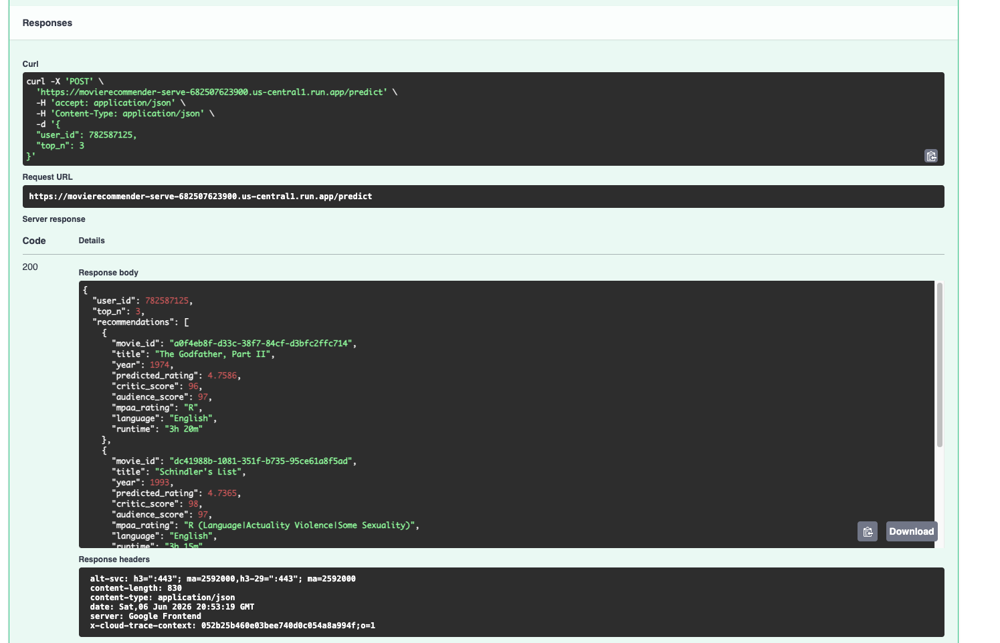
 
  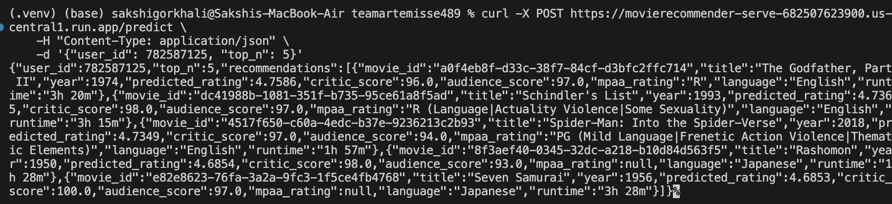

- [ ] **Cloud Functions Deployment (Option A)

- [x] **Cloud Run Deployment (Option B)**: The FastAPI serving container is deployed to Cloud Run as a fully managed, auto-scaling service. 

  - [x] **Create Dockerfile optimized for Cloud Run** (`app/Dockerfile`):
    The serving Dockerfile is intentionally lightweight — it copies only `app/main.py` and `requirements-serve.txt`. No training code, no data, no model. Everything is downloaded from GCS at container startup.
    ```dockerfile
    FROM python:3.11-slim-bookworm
    ENV PORT=8080 GCS_BUCKET=mlops489-dvc-123456
    WORKDIR /app
    COPY requirements-serve.txt .
    RUN pip install --no-cache-dir -r requirements-serve.txt
    COPY app/ app/
    EXPOSE ${PORT}
    CMD ["sh", "-c", "uvicorn app.main:app --host 0.0.0.0 --port ${PORT}"]
    ```
 
  - [x] **Test locally**: API tested locally with uvicorn before deploying:
    ```bash
    uvicorn app.main:app --reload --port 8080
    curl http://localhost:8080/health
    curl -X POST http://localhost:8080/predict \
        -H "Content-Type: application/json" \
        -d '{"user_id": 782587125, "top_n": 5}'
    ```
 
  - [x] **Deploy to Cloud Run with auto-scaling**:
    ```bash
    # Build for linux/amd64 
    docker buildx build \
        --platform linux/amd64 \
        -f app/Dockerfile \
        -t us-central1-docker.pkg.dev/mlops-recommenderproject/mlops489-docker/movierecommender-serve:latest \
        --push \
        .
 
    # Deploy
    gcloud run deploy movierecommender-serve \
        --image us-central1-docker.pkg.dev/mlops-recommenderproject/mlops489-docker/movierecommender-serve:latest \
        --region us-central1 \
        --allow-unauthenticated \
        --memory 4Gi \
        --cpu 2 \
        --timeout 300 \
        --set-env-vars GCS_BUCKET=mlops489-dvc-123456
    ```
 
  - [x] **Document deployment process**:
    | Field | Value |
    |---|---|
    | Service name | `movierecommender-serve` |
    | Region | `us-central1` |
    | URL | `https://movierecommender-serve-682507623900.us-central1.run.app` |
    | Memory | 4 GiB |
    | CPU | 2 vCPU |
    | Timeout | 300 seconds |
    | Concurrency | 80 requests/instance |
    | Max instances | 3 |
    | Scaling | Auto (min 0, max 3) |
    | Billing | Request-based |
    Verify deployment:
    ```bash
    gcloud run services list
    gcloud run services describe movierecommender-serve --region us-central1
    ```
 
    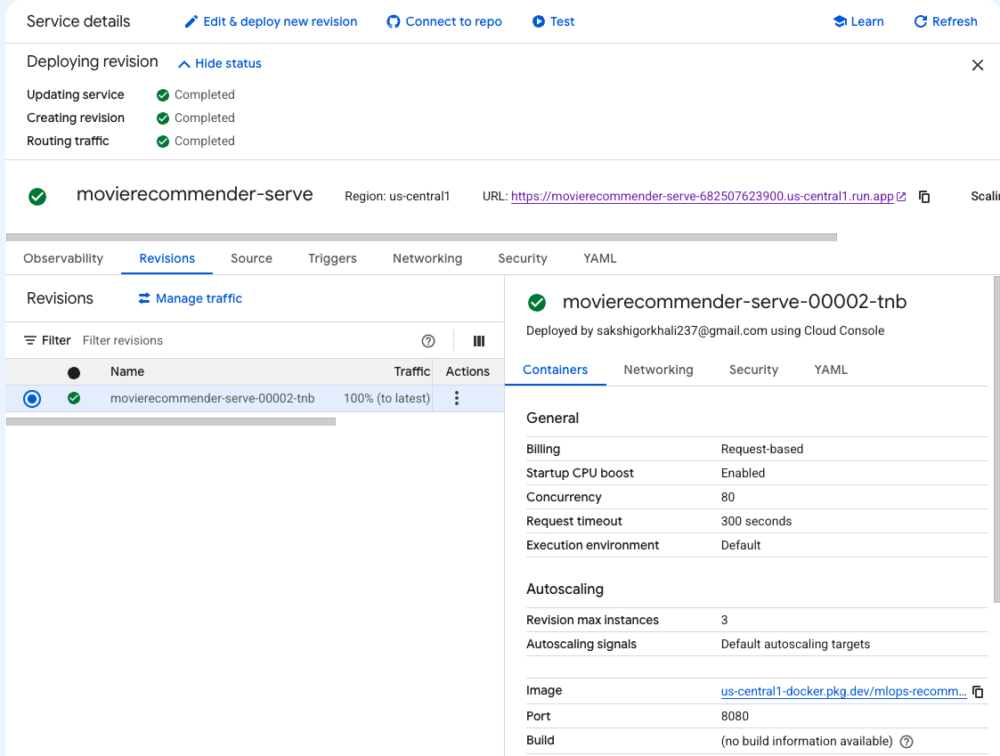
  **Continuous deployment** is wired into `cloudbuild.yaml` — every push to
  `main` rebuilds both images and redeploys the serving container automatically. See `DEPLOYMENT.md` for the full step-by-step guide.

- [ ] **Streamlit/Gradio Deployment (Option C)**: Deploy demo app on HuggingFace Spaces
  - [ ] Create Streamlit or Gradio interface for model
  - [ ] Push to GitHub repository
  - [ ] Deploy to HuggingFace Spaces
  - [ ] Document feature walkthrough
- [ ] **Load Testing**: Test deployment with load testing tool (locust, Apache JMeter)
  - [ ] Establish baseline performance metrics
  - [ ] Document scaling characteristics
- [x] **Monitoring Setup**: Cloud Monitoring dashboard `movierecommender-server` configured with three widgets tracking the live Cloud Run service:
  | Metric | What it shows |
  |---|---|
  | Request Count [SUM] | Number of requests per second |
  | Instance Count [SUM] | Active container instances (scale-to-zero visible) |
  | User Execution Latency [p50] | Median request execution time (~60ms) |
  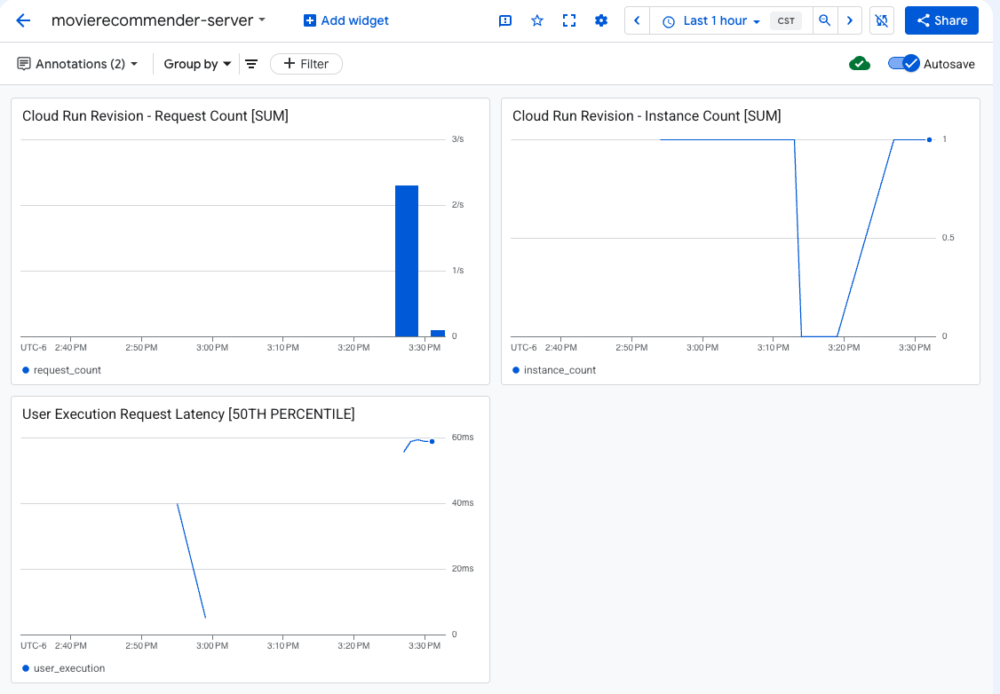

---

## 4. Documentation & Repository Updates

- [ ] **Comprehensive README**: Update README with:
  - [ ] Architecture diagram showing all components
  - [ ] CI/CD pipeline overview
  - [ ] Deployment instructions for each option (Cloud Run, Cloud Functions, HuggingFace)
  - [ ] GCP setup and configuration guide
  - [ ] How to invoke deployed models
  - [ ] Monitoring and troubleshooting guide
  - [ ] Cost estimation and optimization tips
- [ ] **Deployment Guide**: Create detailed DEPLOYMENT.md with:
  - [ ] Step-by-step GCP setup instructions
  - [ ] Cloud Run deployment procedure
  - [ ] Cloud Functions configuration
  - [ ] Environment variables and secrets management
  - [ ] Rollback procedures
- [ ] **API Documentation**: Document all endpoints with:
  - [ ] Request/response schemas
  - [ ] Example curl/Python requests
  - [ ] Error codes and messages
- [ ] **Architecture Documentation**: Include diagrams showing:
  - [ ] Data pipeline
  - [ ] Training pipeline
  - [ ] Inference/serving architecture
  - [ ] CI/CD workflow
- [ ] **Screenshots/Demos**: Add:
  - [ ] Cloud Run dashboard screenshot
  - [ ] Monitoring dashboard screenshot
  - [ ] Streamlit/Gradio app screenshot
  - [ ] API response example
  - [ ] CML workflow output sample
- [ ] **Troubleshooting Guide**: Document solutions for:
  - [ ] Common deployment errors
  - [ ] Authentication issues
  - [ ] Performance problems
  - [ ] Cost overruns
- [ ] **Resource Cleanup Reminder**: Create CLEANUP.md with instructions for:
  - [ ] Deleting GCP resources (VMs, databases, etc.)
  - [ ] Cleaning up Cloud Storage buckets
  - [ ] Disabling APIs to avoid charges
  - [ ] Cost monitoring recommendations
- [ ] **Contributing Guide Update**: Update CONTRIBUTING.md with:
  - [ ] CI/CD requirements
  - [ ] Testing requirements for PRs
  - [ ] Deployment process documentation
- [ ] **Changelog**: Maintain CHANGELOG.md documenting releases and deployments

---

> **Checklist:** Use this as a guide for documenting your Phase 3 deliverables.
