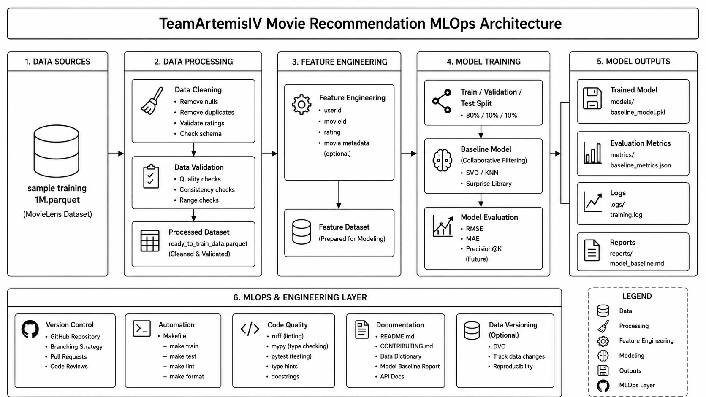

# Artemis Movie Recommender

## Team Information

### TeamArtemisSE489
- Anjan Kumar Basavaraj Gurudatt (ABASAVAR@depaul.edu)
- Joshua Nevin Chandrasekar (JCHANDR2@depaul.edu)
- Sakshi Gorkhali (SGORKHAL@depaul.edu)
- Angel Hernandez (AHERN255@depaul.edu)
  
- SE 456

## Project Overview

We are TeamArtemisSE489, a team for the class Global Software Development, and we are working on a machine learning project that uses machine learning to recommend movies. The data set consists of 56 million user reviews of 10500 Movies. The project will use this dataset to provide recommendations to users on what movie to see next. 

"PROBLEM STATEMENT"

**Key Objectives:**
- [x] Objective 1
Build a scalable movie recommendation system using collaborative filtering techniques to generate personalized movie suggestions based on user ratings and interaction patterns.

- [x] Objective 2
Develop a reproducible MLOps pipeline that automates data preprocessing, feature engineering, model training, evaluation, and model persistence using industry-standard engineering practices.

- [ ] Objective 3
Establish a maintainable and collaborative machine learning workflow with version control, code quality checks, documentation, and modular project structure to support future deployment and continuous improvement.

## Architecture Diagram


## Phase Deliverables

### Phase 1: Project Design & Model Development
- See [PHASE1.md](PHASE1.md) for detailed checklist

### Phase 2: Containerization & Monitoring
- See [PHASE2.md](PHASE2.md) for detailed checklist

### Phase 3: CI/CD & Deployment
- See [PHASE3.md](PHASE3.md) for detailed checklist

## Setup Instructions

### Prerequisites
- Python 3.11+ installed
- Git installed
- (Optional) Docker and Docker Compose

### Installation

**Option 1: Using uv (recommended - faster)**
```bash
pip install uv
uv pip install -r requirements.txt
```

**Option 2: Using pip**
```bash
pip install -U pip
pip install -r requirements.txt
```

### Development Setup

```bash
# Install development dependencies
pip install -r requirements_dev.txt

# Set up pre-commit hooks
pre-commit install

# Run tests to verify setup
pytest tests/
```

### Running the Pipeline

```bash
# Prepare data
make data

# Train the model
make train

# Generate predictions
make predict

# See all available commands
make help
```

## Technology Stack

### Core Dependencies
- **numpy** >= 1.26.0 - Numerical computing
- **pandas** >= 2.2.0 - Data manipulation
- **scikit-learn** >= 1.5.0 - Machine learning algorithms
- **matplotlib** >= 3.9.0 - Visualization
- **tqdm** >= 4.66.0 - Progress bars
- **pyyaml** >= 6.0 - Configuration files
### Deep Learning (PyTorch)
- **torch** >= 2.3.0 - PyTorch framework
### Experiment Tracking
- **mlflow** >= 2.16.0 - MLflow experiment tracking

### Development Tools
- **pytest** >= 8.0 - Testing framework
- **pytest-cov** >= 5.0 - Code coverage
- **ruff** >= 0.6.0 - Linting and formatting
- **mypy** >= 1.11 - Static type checking
- **pre-commit** >= 3.8 - Git hooks framework

## Project Structure
```
teamartemisse489/                  # Repository root
├── src/
│   └── teamartemisse489/          # Importable Python package
│       ├── __init__.py                # Version + package metadata
│       ├── config.py                  # Paths & typed config (PROJECT_ROOT, TrainingConfig, ...)
│       ├── logging_config.py          # setup_logging() + get_logger()
│       ├── data/
│       │   ├── __init__.py
│       │   ├── loaders.py             # load_raw / load_processed / save_processed
│       │   └── make_dataset.py        # Raw → processed pipeline CLI
│       ├── features/
│       │   ├── __init__.py
│       │   └── build_features.py      # Feature engineering
│       ├── models/
│       │   ├── __init__.py
│       │   ├── base.py                # BaseModel ABC (fit/predict/save/load)
│       │   └── model.py               # Concrete Model scaffold
│       ├── evaluation/
│       │   ├── __init__.py
│       │   └── metrics.py             # classification_report, regression_report
│       ├── visualization/
│       │   ├── __init__.py
│       │   └── visualize.py           # Plot helpers
│       ├── utils/
│       │   ├── __init__.py
│       │   ├── io.py                  # JSON helpers
│       │   └── seed.py                # set_seed for reproducibility
│       ├── train_model.py             # Training CLI
│       └── predict_model.py           # Inference CLI
├── tests/                             # Unit and integration tests
│   ├── conftest.py
│   └── test_model.py
├── data/
│   ├── raw/                           # Immutable raw data
│   └── processed/                     # Cleaned, transformed data
├── models/                            # Trained model artifacts (.joblib)
├── notebooks/                         # Jupyter notebooks for exploration
├── reports/
│   └── figures/                       # Generated analysis and figures
├── docs/                              # MkDocs documentation
│   ├── mkdocs.yml
│   ├── index.md
│   ├── getting_started.md
│   └── api.md
├── dockerfiles/                       # Docker configuration
│   └── Dockerfile
├── configs/                           # Hydra configuration (if selected)
│   └── config.yaml
├── api/                               # FastAPI service (if selected)
├── .github/workflows/                 # GitHub Actions CI/CD
│   └── ci.yml
├── PHASE1.md                          # Phase 1 deliverables checklist
├── PHASE2.md                          # Phase 2 deliverables checklist
├── PHASE3.md                          # Phase 3 deliverables checklist
├── .pre-commit-config.yaml            # Pre-commit hooks (Ruff, mypy)
├── Makefile                           # Common commands
├── docker-compose.yaml                # Docker Compose setup
├── pyproject.toml                     # Project config & dependencies
├── requirements.txt                   # Runtime dependencies
├── requirements_dev.txt               # Development dependencies
├── LICENSE
└── README.md
```

### Why `src/` layout?

| | `src/` layout (this template) | Flat layout |
|---|---|---|
| Forces `pip install -e .` before import | ✅ | ❌ |
| Catches packaging bugs early | ✅ | ❌ |
| Adopted by | attrs, httpx, pydantic, flask, sqlalchemy | Older data-science templates |

Data and model artifacts are accessed via the constants in `teamartemisse489.config` (`PROJECT_ROOT`, `DATA_DIR`, `MODELS_DIR`, …) rather than relative paths — code is independent of where you invoke it from.

## Common Commands

```bash
# Install package + runtime dependencies (editable install)
make install

# Install dev tools + pre-commit hooks
make dev

# Run linting and formatting checks
make lint

# Auto-format code
make format

# Run tests
make test

# Clean up build artifacts
make clean

# Docker operations
make docker_build
make docker_run

# Serve documentation locally
make docs
```

## Contribution Summary

TODO:
- [x] Team members have been assigned

## References

- [Project Documentation](docs/index.md)
- [Phase 1 — Project Design & Model Development](PHASE1.md)
- [Phase 2 — Containerization & Monitoring](PHASE2.md)
- [Phase 3 — CI/CD & Deployment](PHASE3.md)
- We have used a dataset from kaggle link: https://www.kaggle.com/datasets/bwandowando/rotten-tomatoes-9800-movie-critic-and-user-reviews. For this project, we are using only 1 million user reviews to recommend movies to users.

## License

This project is licensed under the MIT License. See [LICENSE](LICENSE) for details.
